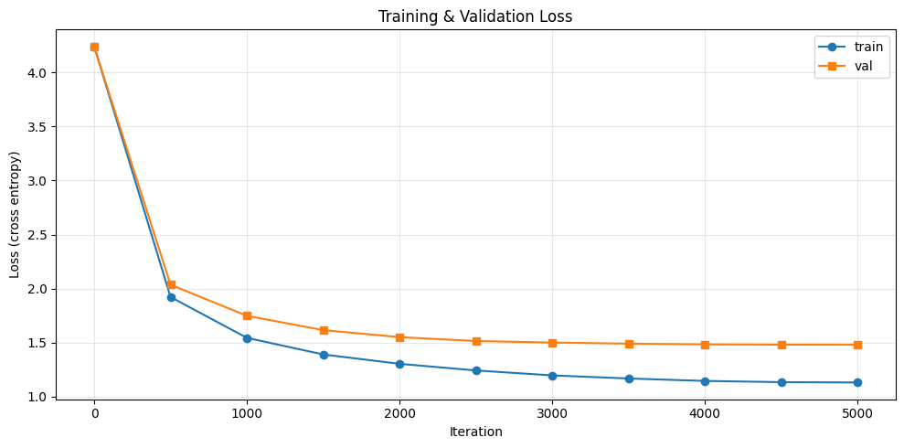

# mini-gpt-from-scratch

> A character-level GPT trained on TinyShakespeare — every component hand-written in PyTorch, no `nn.Transformer`, no Hugging Face, no Lightning. ~300 lines, end-to-end runnable in a single Jupyter notebook.

[](https://pytorch.org/)
[](https://colab.research.google.com/)
[](LICENSE)

## What "from scratch" means here

Built using **only PyTorch primitives** (`nn.Linear`, `nn.Embedding`, `nn.LayerNorm`, `F.softmax`, `F.cross_entropy`).

- ❌ No `nn.Transformer` / `nn.TransformerDecoder`
- ❌ No `nn.MultiheadAttention`
- ❌ No `transformers.GPT2Model.from_pretrained()`
- ❌ No `pytorch_lightning.Trainer`
- ✅ Every component — Causal Self-Attention, position embedding, training loop, generation function — is **hand-written**.

The goal is to **understand**, not to be production-ready. If you want production, use [nanoGPT](https://github.com/karpathy/nanoGPT) or Hugging Face.

---

## Why this repo exists

This is the v2 of my first LLM project, born from a **brutal code review of v1**. v1 had loss converging to 0.01 but generated garbage like `"Tttttttten to learelationships..."`. The post-mortem found three fatal bugs:

1. **No causal mask** — attention saw future tokens during training, so the model was "cheating".
2. **Wrong architecture** — used Encoder-Decoder for an autoregressive LM (should be Decoder-only).
3. **Tiny dataset, no val split** — 6 sentences of training data, model just memorized.

This repo fixes all three, plus a dozen smaller engineering issues (weight tying, gradient clipping, cosine LR schedule, GPU support, train/val split, model checkpointing).

> Full post-mortem narrative: see [Story](#story).

---

## Results

After **5000 iterations** on TinyShakespeare (~1MB) with **6.6M parameters** (n_layer=6, n_head=6, n_embd=384, block_size=256):

| Metric | Value |
|--------|-------|
| Train loss | 1.13 |
| **Val loss** | **1.48** |
| **Val perplexity** | **≈ 4.4** |
| Comparable baseline | nanoGPT @ same scale |
| Training time | ~10 min on Colab T4 GPU |

### Loss curve



### Sample generation (temperature=0.8, top_k=40)

```
ROMEO:
And what a bed with me?

ANGELO:
If thou art a kindness to deep it.

ISABELLA:
O me! I fear your honour's lady!

ISABELLA:
They say that she's news a such as you are,
That would not many are known to hear the souls
To wait this enemies of the fire
Of all present in my own days and woman.

DUKE VINC
```

The model has clearly learned:
- ✅ The play format (`NAME:\ndialogue\n\n`)
- ✅ Real Shakespearean character names (`ROMEO`, `JULIET`, `BENVOLIO` from *Romeo and Juliet*; `ANGELO`, `ISABELLA`, `DUKE VINCENTIO` from *Measure for Measure*)
- ✅ 17th-century English markers (`thou art`, `kill'd`, `'tis`, `O me!`, British `honour`)

What it hasn't learned (and can't, at this scale):
- ❌ Long-range semantic coherence — sentences are locally grammatical but globally nonsense (Romeo refers to himself as a mother 😄)
- This is a fundamental limit of **character-level LM + 6.6M params + 1MB data**, not a bug.

More samples in [`assets/samples.txt`](assets/samples.txt).

---

## Architecture

```
idx (B, T)
   │
   ├── wte (token embedding)
   └── wpe (learned position embedding)
   │
Dropout
   │
   ▼  ×6 layers
┌───────────────── Block ─────────────────┐
│  x = x + CausalSelfAttention(LN(x))      │  ← causal mask via register_buffer
│  x = x + MLP(LN(x))                      │
└──────────────────────────────────────────┘
   │
LayerNorm (ln_f)
   │
lm_head (weight-tied with wte)
   │
Cross Entropy / Softmax → next-token prediction
```

**Engineering best practices included:**

- Pre-LN architecture (`x + sublayer(LN(x))`) — more stable than the original Post-LN
- Weight tying between input embedding and output projection (GPT-2 standard)
- Gradient clipping (`max_norm=1.0`)
- Linear warmup (100 steps) + cosine decay LR schedule
- Train/val split (90/10) with periodic validation loss tracking
- GPU auto-detection (`device = 'cuda' if torch.cuda.is_available() else 'cpu'`)
- Full model + tokenizer + history checkpointing in a single `.pt` file

---

## Quick start

### Run on Google Colab (recommended — free T4 GPU)

1. Open `mini_gpt.ipynb` in Colab
2. Click **Runtime → Change runtime type → T4 GPU**
3. **Runtime → Run all** (~10 min)

### Run locally

```bash
git clone https://github.com/<your-username>/mini-gpt-from-scratch.git
cd mini-gpt-from-scratch

pip install -r requirements.txt
jupyter notebook mini_gpt.ipynb
```

> ⚠️ Without GPU, training takes ~40 minutes instead of 10. Reduce `max_iters` to 1000 if just exploring.

---

## File structure

```
mini-gpt-from-scratch/
├── mini_gpt.ipynb        # Main notebook (data → model → train → generate)
├── README.md             # This file
├── requirements.txt      # PyTorch + matplotlib
├── LICENSE               # MIT
├── .gitignore            # Excludes .pt checkpoints, data, etc.
└── assets/
    ├── loss_curve.png    # Training curve
    └── samples.txt       # Generation samples (3 temperatures)
```

---

## Story

> *Why I'm proud of this 300-line notebook.*

### Day 1 — v1, "looks great"
I followed the [Happy-LLM tutorial](https://github.com/datawhalechina/happy-llm) and built a Transformer with full Encoder-Decoder. Loss dropped from 3.5 to **0.0167** after 1500 steps. I thought I had nailed it.

Then I generated text:

```
"Tuuuuuuuuuuuuuuuuuuuuuuuuuuuuttton o paruanguage tuargugua tugnin..."
```

😶 Garbage.

### Day 2 — Code review

Three killer bugs:

1. **No causal mask** — `att = F.softmax(QK^T / sqrt(d), dim=-1)` directly. The model could see future tokens during training, so it was just "copying the answer". At inference time, future positions were empty → it had never learned to actually predict from history → garbage.

2. **Encoder + Decoder for autoregressive LM** — I'd applied the original Transformer architecture (designed for translation) to a next-token prediction task. The encoder was redundant and the data flow was confused.

3. **Six sentences of training data, no val split** — The model wasn't learning, it was memorizing. Loss=0.01 was an illusion.

### Day 3 — v2

Rewrote everything in Decoder-only style (this repo). Added the engineering best practices listed above.

After 5000 steps: **val_loss=1.48**, generates real Shakespearean dialogue with correct character names.

### Lesson

> **Loss going down ≠ model is learning.** Always look at:
> 1. Train/val gap
> 2. Generation quality (eyeballed)
> 3. Comparison to a baseline

---

## What I learned

- **Causal mask isn't a "minor detail" — it's the soul of an autoregressive LM**. Without it, the model has nothing to predict.
- **Architecture choice > module implementation**. v1 had perfectly fine MultiHeadAttention and Block classes, but the wrong overall architecture rendered it useless.
- **Loss → perplexity translation gives intuition**. `e^1.48 ≈ 4.4`: the model is choosing among ~4 candidates per character. Random guessing among 65 characters would give perplexity 65. This suddenly made loss numbers feel concrete.
- **Scaling Law is observable even at 6M parameters**. Val loss plateaued at 1.48 around step 3500 — that's the capacity ceiling for this model size. To go lower, you must scale up.
- **Style ≠ semantics in character-level models**. The model perfectly captured Shakespearean style (vocabulary, format, character names) but couldn't produce coherent meaning. Style is a surface pattern (small models can learn it); semantics requires long-range dependencies + world knowledge (needs scale).

---

## What's next

- [ ] **Scale up**: `n_layer=12, n_embd=768` (~60M params), train for 20k steps, see if val loss can break 1.2
- [ ] **BPE tokenizer**: replace char-level with `tiktoken.get_encoding("gpt2")`
- [ ] **Flash Attention**: swap hand-rolled attention for `F.scaled_dot_product_attention`
- [ ] **RoPE**: replace learned positional embeddings with rotary embeddings

---

## References & inspiration

- [Andrej Karpathy — *Let's build GPT: from scratch*](https://www.youtube.com/watch?v=kCc8FmEb1nY) — the canonical educational reference for this kind of project
- [nanoGPT](https://github.com/karpathy/nanoGPT) — the production-quality version (~300 LoC)
- [Happy-LLM](https://github.com/datawhalechina/happy-llm) — the Chinese LLM tutorial that started this journey
- [Attention Is All You Need (Vaswani et al., 2017)](https://arxiv.org/abs/1706.03762) — the original Transformer paper
- [Language Models are Unsupervised Multitask Learners (GPT-2 paper, 2019)](https://cdn.openai.com/better-language-models/language_models_are_unsupervised_multitask_learners.pdf)

---

## License

MIT — see [LICENSE](LICENSE). Educational repo, do whatever you want with it.

---

> Built as part of my journey from a telecom systems engineer into the AI/LLM world.
> If this repo helped you, a ⭐ would mean a lot.
